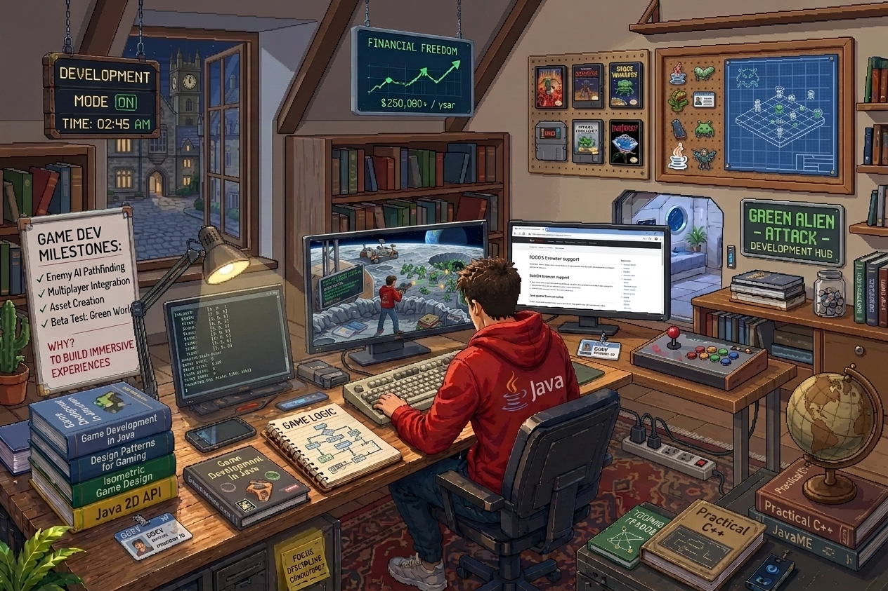
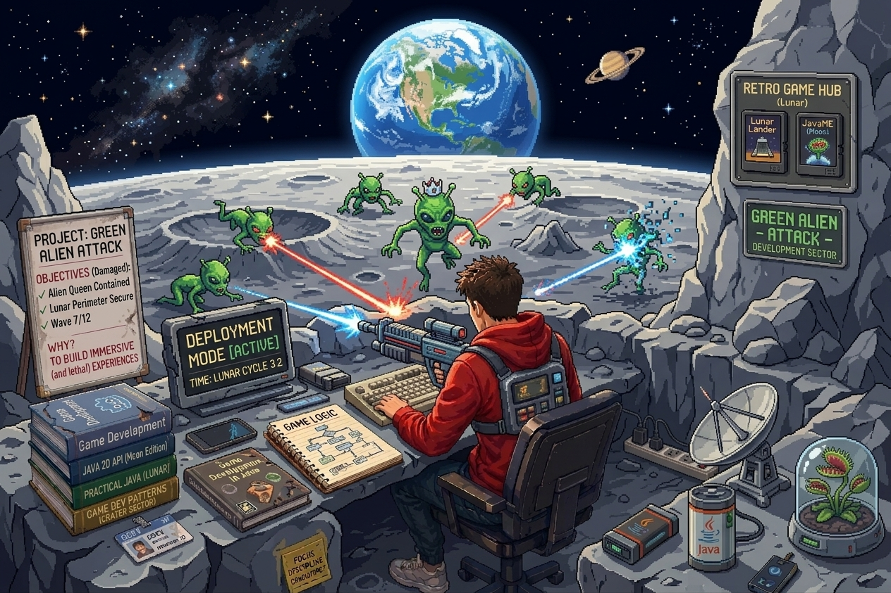
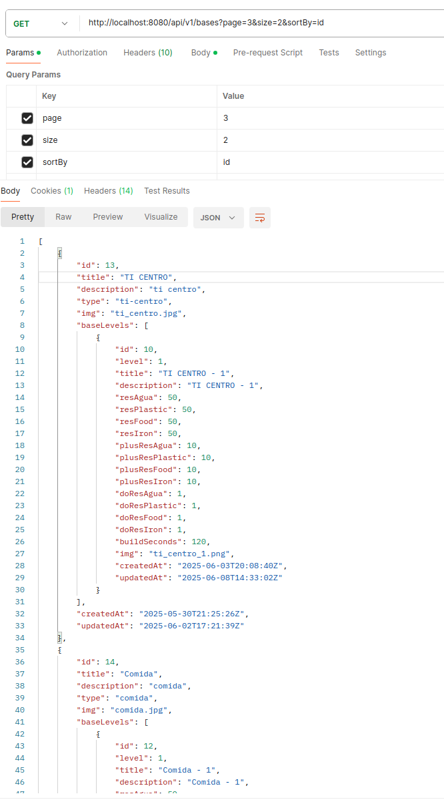
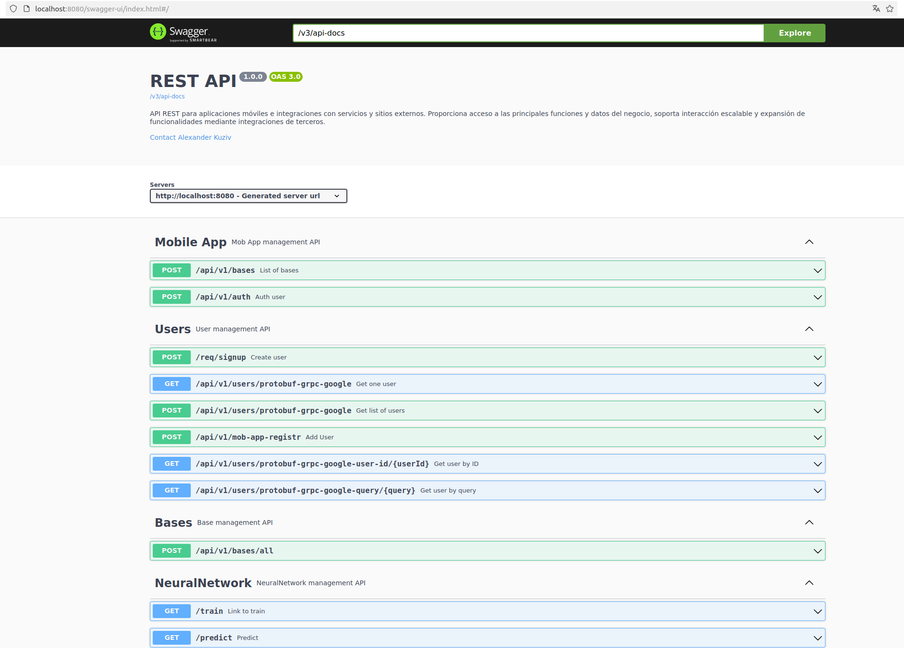
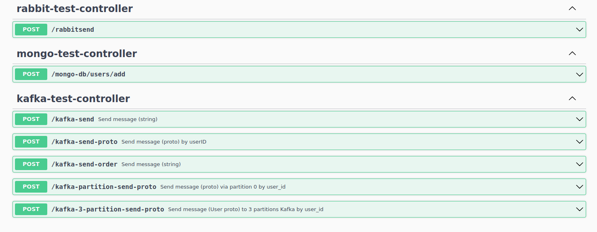

# El proyecto: Green Alien Attack 📡🛸👽 Java, Browser game

A production-ready **Browser Game** ecosystem built with **Java, Docker-compose** infrastructure, and a robust relational database (PostgreSQL) architecture.

The project name **'Green Alien Attack'** reflects a dynamic, retro-futuristic arcade experience where **web-based frontend** (Thymeleaf) interfaces seamlessly communicate with a scalable **Java backend** to track players, sessions, and live scores.

Yo como Arquitectador =) pinté esta eschema **UML** para mejor entender el proyecto con sus tablas
en base de datos. 

    
    

### 🎨 Modelo de Base de Datos

A continuación se detalla el diseño de las tablas y las relaciones que dan soporte al sistema de puntuación, usuarios y estado de las partidas

### 🛸 Galería y Plantillas Visuales

El juego cuenta con una interfaz web dinámica. Aquí puedes ver algunas de las plantillas visuales y fondos utilizados para ambientar la invasión alienígena

Tu puedes pagar y comprar nuevos artifactos desde tu tarjeta o USDT (Tether)... Para este en mi proyecto yo utilizo Web3J...

    
    
    
    
    
    
    
    

### 🚀 Tecnologías UtilizadasBackend: Java (Spring Boot / Thymeleaf)

- **Backend:** Java (Spring Boot)
- **Base de Datos:** SQL (PostgreSQL / MySQL) gestionada de forma persistente.
- **Infraestructura:** Docker & Docker Compose para un despliegue rápido y aislado.
- **Frontend:** HTML5, CSS3, JavaScript (DOM para el renderizado del juego).
- **CI/CD:** GitHub Action / Jenkins (Automatización de pruebas y despliegue).

### 📮 En Postman

 

<!--img src="./src/main/resources/mystatic/images/protobuf/1000000106.png" width="170" /-->

### 🤖 Swagger - OpenApi - REST API 

y más

Pronto será más... 

